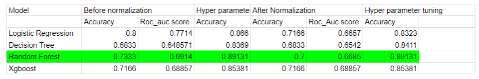
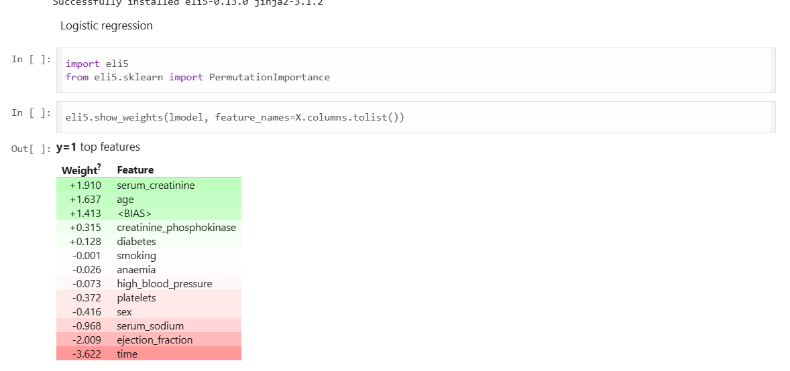
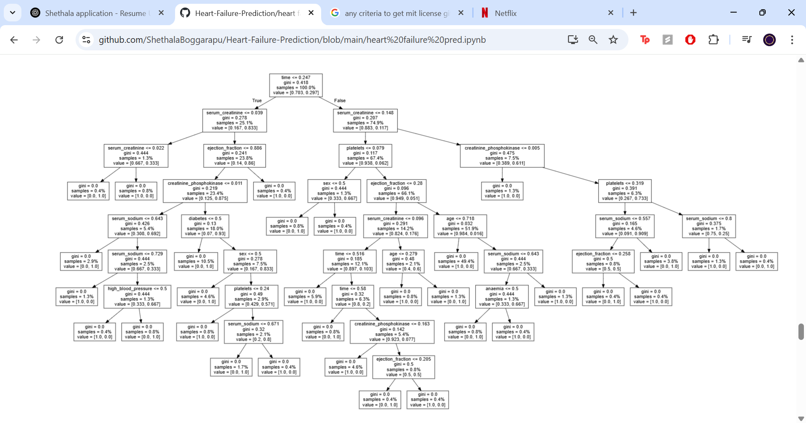
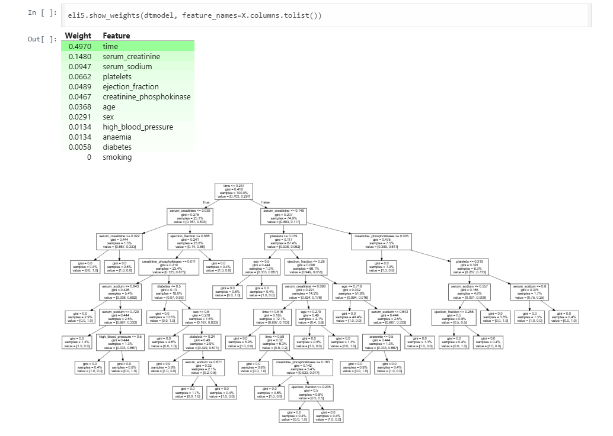
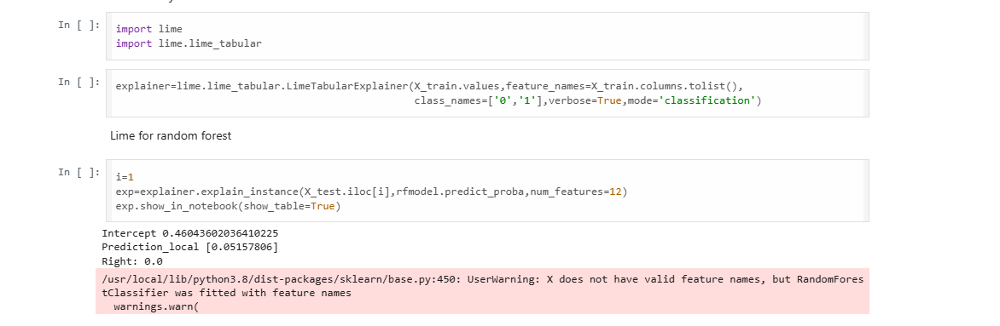

# 📊 Heart Failure Prediction - Results Summary

This project explores the application of machine learning models to predict heart failure based on patient clinical records. It includes evaluation, interpretability, and comparative model insights.

---

## ✅ Models Evaluated

- **Logistic Regression**
- **Decision Tree**
- **Random Forest**
- **XGBoost**

All models were tested with:
- Raw data
- Normalized data
- Hyperparameter tuning

---

## 📈 Model Performance Summary

- **Random Forest** achieved highest accuracy: **89.13%**
- **XGBoost** followed with **85.38%**
- Preprocessing and tuning significantly boosted model performance

---

## 🔬 Feature Importance & Interpretability

### 🔹 ELI5 - Logistic Regression Weights

### 🔹 ELI5 - Logistic Regression Prediction Breakdown

### 🔹 ELI5 - Decision Tree Feature Importance

### 🔹 Decision Tree Visual Structure

### 🔹 ELI5 - XGBoost and Random Forest Weights

### 🔹 LIME - Random Forest Local Explanation

### 🔹 SHAP Summary Plot

---

## 🎯 Predictions Comparison

The following visual shows model prediction probabilities for test instances:

---

## 📊 Visual Insights

- Tableau heatmap (`heatmap.png`) shows feature correlation
- Notebook includes additional visualizations for each modeling step

---

## 🧾 Conclusion

- Ensemble models with feature explainability tools (ELI5, SHAP, LIME) deliver strong predictive power and transparency
- **Random Forest** + **SHAP/ELI5** combination provided the best tradeoff between accuracy and explainability

---

**Author**: Shethala Boggarapu
